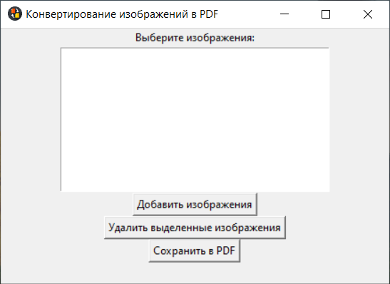

# Конвертация изображений в PDF

Программа, позволяющая пользователям конвертировать изображения в формате JPG, JPEG, PNG и BMP в файл PDF.

## Описание

Это простое приложение на Python, использующее библиотеки `tkinter` для создания графического интерфейса и `PIL` (Pillow) для работы с изображениями. Оно позволяет пользователям загружать изображениях и сохранять их в виде единого PDF-документа.

## Использование

1. В приложении выберите изображения, которые хотите конвертировать. Для этого нажмите кнопку **"Добавить изображения"**.
2. Выделите изображения, которые вы хотите удалить, и нажмите **"Удалить выделенные изображения"**.
3. Нажмите кнопку **"Сохранить в PDF"** и выберите место для сохранения вашего PDF-файла.

## Интерфейс

